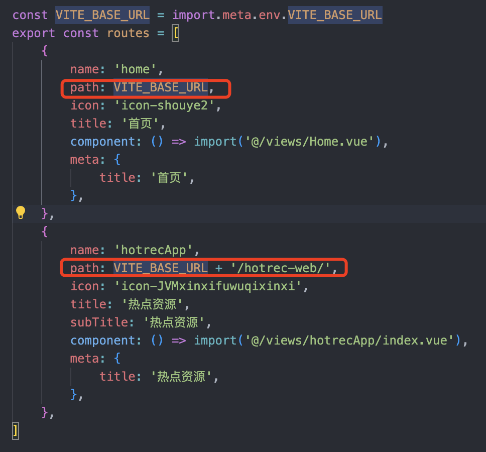

# iframe 微前端

# 项目介绍

基于 iframe，将每一个菜单对应的子应用嵌入到主应用中，实现统一的前端架构，只限于样式展示，逻辑处理还是单独每一个子应用处理，有局限性。

# iframe 微前端配置

- mainApplication：主应用，通过 iframe 嵌入子应用
- subApplication：子应用，被嵌入到主应用中

## 1. mainApplication 配置

- 在 mainApplication 中，通过 iframe 嵌入子应用，并设置 iframe 的 src 为子应用的地址
- 在 mainApplication 中，通过 iframe 的 onload 事件，获取子应用的 window 对象，并调用子应用的方法

### 1.1 主应用监听子应用

- 全局监听，放置在 html 中

```js
//全局监听路由变化--
window.addEventListener("message", (e) => {
  const { data, type, webApp } = e.data || {};
  // console.log(type, data, webApp, 'unified-app')
  if (
    (type === "beforeHistoryChange" || type === "afterHistoryChange") &&
    data?.url
  ) {
    // 这里先采用一个兜底的URL承接任意地址
    // const entry = `/config-web/${webApp}?entry=${encodeURIComponent(data.url)}`
    const entry = `/config-web/${webApp}/${data.url}`;
    // 地址不一样才需要更新
    if (location.pathname + location.search !== entry) {
      window.history.replaceState(null, "", entry);
    }
  }
});
```

### 1.2 设置 iframe 的 src 属性

```vue
<template>
  <iframe
    ref="iframe"
    :src="iframeSrc"
    frameborder="0"
    width="100%"
    height="100%"
  />
</template>

<script setup>
import { ref, watchEffect } from "vue";
import { useRoute } from "vue-router";

const route = useRoute();
const APP_URL = import.meta.env.VITE_APP_HOT;
const iframeSrc = ref(APP_URL + "");

watchEffect(() => {
  console.log("页面刷新");
  iframeSrc.value = APP_URL + route.hash;
});
</script>
```

### 1.3 .env.development 配置

```js
VITE_APP_HOT = "http://localhost:8090/";
```

## 2. subApplication 配置

- 在 subApplication 中，通过 window.parent 获取父应用的 window 对象，并调用父应用的方法

### 2.1 子应用调用父应用方法

- 子应用和主应用连接通信：为了让 URL 地址尽早地更新，这段代码需要尽可能前置，例如可以直接放在 document.head 中

```js
// 和主应用连接通信
const postMessage = function (type: string, data: any) {
  if (window.parent !== window) {
    window.parent.postMessage(
      {
        type: type,
        data: data,
        webApp: "hotrec-web",
      },
      "*"
    );
  }
};
// 为了让URL地址尽早地更新，这段代码需要尽可能前置，例如可以直接放在document.head中
postMessage("afterHistoryChange", { url: location.href });

// 在路由变化前、跳转前，子应用路由拦截 router.beforeEach方法中，需要先通知主应用，让主应用更新URL地址
function beforeRedirect(href: string) {
  postMessage("beforeHistoryChange", { url: href });
}

export { beforeRedirect };
```

### 2.2 子应用路由变化反馈到主应用

- router 配置页面，在路由变化前、跳转前，子应用路由拦截 router.beforeEach 方法中，需要先通知主应用，让主应用更新 URL 地址

```js

import { beforeRedirect } from '@/utils/postMessage'
/**
 * @description 路由拦截 beforeEach
 * */
router.beforeEach(async (to: any, from, next) => {
    // 子应用路由变化反馈给到主应用
    beforeRedirect(to.href || to.fullPath)
    ...
})

```

# iframe 微前端开发中遇到的问题

## 1. iframe 受同源限制，不同源可通过 window.postMessage 通信

受到同源策略规定的规则约束，与 iframe 父级同源，那么父级页面可以访问 iframe 的文档以及内部 DOM，如果它们跨源，则父页面对窗口属性的访问权限极其有限。

如果两个 URL 具有相同的协议，域，和端口，则称它们是同源的。

以下几个 URL 是同源的：

- site.com
- site.com/
- site.com/a/index.html

以下是不同源的：

- https://site.com
- http://bbs.site.com
- site.com:8080
- http://site.org
- http://localhost:8080
- http://localhost:8090

所以为了能让不同源中的文档进行交流，可以使用 window.postMessage 方法，它允许来自不同源的脚本采用异步方式进行有限的通信，可以实现跨文档、跨窗口、跨域消息传递，同时设置 iframe 的 src 属性，使其能够加载不同源的页面。

iframe

> iframe 标签承载了一个单独的嵌入的窗口，它有自己的 document 和 window
>
> iframe.contentWindow 来获取 中的 window
>
> iframe.contentDocument 来获取 中的 document ， 是 iframe.contentWindow.document 的简写。

## 2. URL 的同步更新

**问题**

iframe 的 src 属性设置：http://localhost:8080/#/login

主应用浏览器地址：http://localhost:5173/config-web/hotrec-web/http://localhost:8080/#/login

子应用登录成功，路由切换，页面变了，但是浏览器地址栏不变

**解决方案**

1. 子应用在路由变化时，通过 window.parent.postMessage 通知主应用，让主应用更新 URL 地址，主应用监听 message 事件，获取子应用传递的 URL 地址，然后更新主应用的 URL 地址。

`/src/utils/postMessage.ts`

```js
// 和主应用连接通信
const postMessage = function (type: string, data: any) {
  if (window.parent !== window) {
    window.parent.postMessage(
      {
        type: type,
        data: data,
        webApp: "hotrec-web",
      },
      "*"
    );
  }
};
// 为了让URL地址尽早地更新，这段代码需要尽可能前置，例如可以直接放在document.head中
postMessage("afterHistoryChange", { url: location.href });
// 在路由变化前、跳转前，子应用路由拦截 router.beforeEach方法中，需要先通知主应用，让主应用更新URL地址
function beforeRedirect(href: string) {
  postMessage("beforeHistoryChange", { url: href });
}

export { beforeRedirect };
```

`/src/router/index.ts`

```js
import { beforeRedirect } from '@/utils/postMessage'

/**
 * @description 路由拦截 beforeEach
 * */
router.beforeEach(async (to: any, from, next) => {
    // 子应用路由变化反馈给到主应用
    beforeRedirect(to.href || to.fullPath)
    ...
    next()
})
```

2. 主应用接收子应用传递的 URL 地址，然后更新主应用的 URL 地址。

`/src/utils/postMessage.ts`

```js
window.addEventListener("message", (e) => {
  const { data, type, webApp } = e.data || {};
  if (
    (type === "beforeHistoryChange" || type === "afterHistoryChange") &&
    data?.url
  ) {
    //地址拼接，和主应用保持一致。URL地址栏看起来更像单页面
    //主应用的路由路径，也要补全 path: VITE_BASE_URL + "/hotrec-web/",
    const baseUrl = "/config-web",
      routerPath = webApp, //hotrec-web
      subPath = data.url; //  #/home , #/hotHistory 等
    const entry = `${baseUrl}/${webApp}/${subPath}`;
    // 地址不一样才需要更新
    if (location.pathname + location.search !== entry) {
      window.history.replaceState(null, "", entry);
    }
  }
});
```




## 3. 页面手动刷新，iframe 子应用渲染失败

**问题**

比如在当前页面 http://localhost:5173/config-web/hotrec-web/#/home，手动刷新后，iframe 子应用渲染失败，显示空白页面，但是子应用本身是正常的，可以正常访问。


**原因**

主应用路由配置不对

原路由配置

```js
export const routes = [
  {
    name: "home",
    path: "/",
    icon: "icon-shouye2",
    title: "首页",
    component: () => import("@/views/Home.vue"),
    meta: {
      title: "首页",
    },
  },
  {
    name: "hotrecApp",
    path: "/hotrec-web/",
    icon: "icon-JVMxinxifuwuqixinxi",
    title: "热点资源",
    subTitle: "热点资源",
    component: () => import("@/views/hotrecApp/index.vue"),
    meta: {
      title: "热点资源",
    },
  },
];
```

**解决方案**

`VITE_BASE_URL = '/config-web'`

1. 配置 base 路径

```js
 base: VITE_BASE_URL,
```

2. 修改路由配置

```js
export const routes = [
  {
    name: "home",
    path: VITE_BASE_URL,
    icon: "icon-shouye2",
    title: "首页",
    component: () => import("@/views/Home.vue"),
    meta: {
      title: "首页",
    },
  },
  {
    name: "hotrecApp",
    path: VITE_BASE_URL + "/hotrec-web/",
    icon: "icon-JVMxinxifuwuqixinxi",
    title: "子应用",
    subTitle: "子应用",
    component: () => import("@/views/hotrecApp/index.vue"),
    meta: {
      title: "子应用",
    },
  },
];
```

3. el-menu 的 default-active 参数和 el-menu-item 中的 index 保持一致


## 4. 页面刷新，URL 跳转到默认地址

**问题**

比如在当前页面 http://localhost:5173/config-web/hotrec-web/#/hotWhite，手动刷新后，URL 跳转到默认地址 http://localhost:5173/config-web/hotrec-web/#/home

**原因**

iframe 的 src 属性没有变化

**解决方案**

通过 watchEffect 监听页面，页面刷新的时候，动态设置 iframe 的 src 属性

`/src/components/Iframe.vue`

```vue
<template>
  <iframe :src="iframeSrc" width="100%" height="100%" frameborder="0" />
</template>

<script setup>
import { ref, watchEffect } from "vue";
import { useRoute } from "vue-router";

const route = useRoute();
const APP_URL = import.meta.env.VITE_APP_HOT;
//VITE_APP_HOT = 'http://localhost:8080/'

const iframeSrc = ref(APP_URL + "");

watchEffect(() => {
  iframeSrc.value = APP_URL + route.hash;
  console.log("页面刷新", iframeSrc.value);
});
</script>
```


## 5. vue+element 下 iframe 子页面弹窗蒙层只能遮罩子页面

**问题**

如下图，iframe 子页面弹窗蒙层只能遮罩子页面


想要的效果是蒙层遮罩整个页面，包括主页面和子页面

**原因**

iframe 子页面是一个完整的 html，而 el-dialog 蒙层 append-to-body，查询的是 iframe 下的 body

**解决方案**

思路：

（1）触发蒙层弹框的显示隐藏主页面控制

（2）子页面触发弹框时，发送信息给到主页面；

（3）主页面添加 el-dialog 标签，并监听子页面发送的消息， 根据弹框的`model-value`值（显示隐藏）值,主页面 el-dialog 显示隐藏，

实现：

子页面

通过 postMessage 通知主页面弹框状态

`/utils/postMessage.ts`

```js
const postMessage = function (type: string, data: any) {
  if (window.parent !== window) {
    window.parent.postMessage(
      {
        type: type,
        data: data,
        webApp: "hotrec-web",
      },
      "*"
    );
  }
};
//vue + Element-UI下iframe子页面弹窗蒙层只能遮罩子页面问题和弹框内容居中显示
//子页面通过postMessage通知主页面,子页面根据isDialog的值来修改蒙层样式
const dialogPostMessage = (isDialog: boolean) => {
  // iframe 弹框样式修改
  postMessage("changeDialog", { isDialog: isDialog });
};

export { dialogPostMessage };
```

`引用<el-dialog/>的页面`

```vue
<template>
  <el-dialog
    :model-value="visible"
    :title="title"
    :close-on-click-modal="false"
    :close-on-press-escape="false"
    :destroy-on-close="true"
    append-to-body
    @close="handleCancel(ruleFormRef)"
    :width="width"
    center
    modal-class="dialog-iframe"
  >
    ...

    <template #footer>
      <span class="dialog-footer">
        <el-button @click="handleCancel(ruleFormRef)">取消</el-button>
        <el-button type="primary" @click="handleConfirm(ruleFormRef)">
          确定
        </el-button>
      </span>
    </template>
  </el-dialog>
</template>
<script setup lang="ts">
import { dialogPostMessage, changeDialogStyle } from "@/utils/postMessage";

...

onMounted(() => {
  //子页面传值给父页面，记录弹框的visible
  dialogPostMessage(props.visible);
});

const ruleFormRef = ref<FormInstance>();

const handleConfirm = async (formEl: FormInstance | undefined) => {
  if (!formEl) return;
  await formEl.validate((valid, fields) => {
    if (valid) {
      props.onConfirm(formData.value);
      dialogPostMessage(false); //子页面传值给父页面，记录弹框的visible
    } else {
      console.log("error submit!", fields);
    }
  });
};
//取消/关闭按钮
const handleCancel = (formEl: FormInstance | undefined) => {
  if (!formEl) return;
  formEl.resetFields(); //重置校验
  formEl.clearValidate(); // 清除校验
  props.onCancel();
  dialogPostMessage(false); //子页面传值给父页面，记录弹框的visible
};
</script>
```

主页面

添加全局 el-dialog,监听子页面传递的信息，根据 `isDialog` 值作出判断，处理弹框消息

`/componets/Iframe.vue`

```vue
<template>
  <div class="parent" id="parentDiv">
    <iframe
      id="bdIframe"
      ref="iframeRef"
      :src="iframeSrc"
      :key="iframeRef"
      width="100%"
      height="100%"
      frameborder="0"
    />

    <!-- 解决Elementt弹窗蒙层只能遮罩子页面问题 ，父页面中添加个蒙层-->
    <el-dialog
      modal-class="dialog-parent-iframe"
      :model-value="dialogTableVisible"
      :close-on-press-escape="false"
      :close-on-click-modal="false"
      center
    />
  </div>
</template>
<script setup>
import { ref, watchEffect, onMounted, onUnmounted, computed } from "vue";
import { useRoute } from "vue-router";
const route = useRoute();

const props = defineProps(["appUrl", "iframeRef"]);

const APP_URL = props.appUrl;
const iframeSrc = ref(APP_URL + "");

watchEffect(() => {
  iframeSrc.value = APP_URL + route.hash;
  console.log("页面刷新", iframeSrc.value);
});

onMounted(() => {
  // 监听子页面传来的值
  window.addEventListener("message", changeDialog, false);
});

onUnmounted(() => {
  // 销毁
  window.removeEventListener("message", changeDialog, false);
});

//父页面监听子页面处理弹框消息
const dialogTableVisible = ref(false);
const changeDialog = (event) => {
  const { type, data } = event.data || {};
  if (type === "changeDialog") {
    //isDialog为子页面弹框的开关，解决弹窗蒙层只能遮罩子页面问题
    dialogTableVisible.value = data.isDialog;
    if (data.isDialog) {
      //当子页面弹框开时
      //1.手动隐藏主应用的弹框，解决隐藏弹框时，主页面中弹框dialog有内容闪现问题
      document.getElementsByClassName("dialog-parent-iframe")[0].style.display =
        "block";
      //2.将子页面iframe页面层级提升
      document.getElementById("parentDiv").style.position = "relative";
      document.getElementById("bdIframe").style.position = "absolute";
      document.getElementById("bdIframe").style.zIndex = 10000;
    } else {
      //当子页面弹框关时
      document.getElementsByClassName("dialog-parent-iframe")[0].style.display =
        "none ";
      //恢复样式
      document.getElementById("parentDiv").style.position = "unset";
      document.getElementById("bdIframe").style.position = "unset";
      document.getElementById("bdIframe").style.zIndex = "unset";
    }
  }
};
</script>

<style lang="scss" scoped>
.parent {
  width: 100%;
  height: 100%;
}
</style>
```

## 6. vue+element 下 iframe 子页面弹框不居中问题

**问题**

如下图，弹框显示不居中


**解决方案**

思路：

弹框还是以 iframe 子页面为父元素，将弹框向左移动父页面的菜单宽度，如果父页面有头部内容，向上移动父页面的头部宽度

此时我们修改的是`.el-overlay-dialog`的 left 值，


但是会有多个 .el-overlay-dialog,


所以子页面中的`el-dialog`都要给到唯一的`modal-class`

方案：

子页面

子页面向主页面发送弹框信息：

(1) 弹框状态值:主页面根据监听的弹框状态值处理相应逻辑

(2) modalClass:主页面将获取到的子页面 iframe 中的 dom 元素再传给子页面，不同源下，主页面获取不到子页面，只能通过 postMessage 传递

```js
//vue + Element-UI下iframe子页面弹窗蒙层只能遮罩子页面问题和弹框内容居中显示
//子页面通过postMessage通知主页面,子页面根据isDialog的值来修改蒙层样式
const dialogPostMessage = (isDialog: boolean, dialogModalClass: string) => {
  // iframe 弹框样式修改
  postMessage("changeDialog", {
    isDialog,
    dialogModalClass,
  });
};

// 主页面通过postMessage通知子页面，接收父页面发送的消息--动态设置el-overlay-dialog的样式，解决弹框居中的问题
const changeDialogStyle = (event: any) => {
  const { type, data } = event.data || {};
  // console.log('我是父页面传递过来的', data)
  if (type === "style-left" && data) {
    const { dialogModalClass, left } = data;
    document
      .getElementsByClassName(dialogModalClass)[0]
      .getElementsByClassName("el-overlay-dialog")[0].style.left = left;
  }
};
```

```vue
<template>
  <el-dialog
    :model-value="visible"
    draggable
    :modal-class="modalClass"
    :close-on-click-modal="false"
    :close-on-press-escape="false"
    :destroy-on-close="true"
    :append-to-body="true"
    @close="closeDialog"
    :modal-class="modalClass"
  >
    ...
  </el-dialog>
</template>
<script>
import { ref, onMounted, onUnmounted } from "vue";
const modalClass = ref("dialog-iframe");

onMounted(() => {
  //子页面传值给父页面，记录弹框的visible
  dialogPostMessage(props.visible, modalClass.value);
  //监听父页面传递的值
  window.addEventListener("message", changeDialogStyle, false);
});

onUnmounted(() => {
  //销毁
  window.removeEventListener("message", changeDialogStyle, false);
});
</script>
```

主页面

父页面向子页面发送消息：

（1）主菜单侧边栏宽度

（2）子页面传来的 modalClass 值

```vue
<script lang="ts" setup>
const changeDialog = (event) => {
    const { type, data } = event.data || {}
    if (type === 'changeDialog') {
        //isDialog为子页面弹框的开关，解决弹窗蒙层只能遮罩子页面问题
        dialogTableVisible.value = data.isDialog
        if (data.isDialog) {
            //当子页面弹框开时
            ...
            // 父页面向子页面发送消息--解决弹框居中的问题
            let iframeWin = window.frames['bdIframe']
            iframeWin.contentWindow.postMessage(
                {
                    type: 'style-left',
                    data: {
                        left: isCollapse.value ? '-65px' : '-210px',
                        dialogModalClass: data.dialogModalClass,
                    },
                },
                '*', //解决iframe跨域问题
            )
        } else {
            //当子页面弹框关时
            ...
        }
    }
}
</script>
```

## 7. 如果 iframe 宽度太小，`el-dialog`还是会只在子页面中，超出隐藏，如下图所示


## 8. 多个子应用切换，sessionStorage 数据清空，需要重复登录

- 解决方案：不用 sessionStorage 存储，改为 localStorage 存储，或者使用 cookie 存储

```js
localStorage.setItem("Authorization", res.data.token);

const Authorization = localStorage.getItem("Authorization");
```

## iframe 微前端存在跨域问题，需要配置跨域

- 解决方案：在主应用和子应用中配置跨域，可以使用 CORS 或 JSONP 等方式解决跨域问题

## iframe 微前端存在样式冲突问题，需要统一样式

- 解决方案：在主应用和子应用中统一样式，可以使用 CSS reset 或 normalize.css
  等方式解决样式冲突问题

## iframe 微前端存在性能问题，需要优化加载速度

- 解决方案：在主应用和子应用中优化加载速度，可以使用懒加载、预加载、缓存等技术优化加载速度

## iframe 微前端存在安全性问题，需要防止 XSS 攻击

- 解决方案：在主应用和子应用中防止 XSS 攻击，可以使用 XSS
  过滤器、内容安全策略等技术防止 XSS 攻击

## iframe 微前端存在兼容性问题，需要兼容不同浏览器

-解决方案：在主应用和子应用中兼容不同浏览器，可以使用 Babel、Polyfill
等方式解决兼容性问题

# 总结 - iframe

微前端是一种比较简单、易实现的方式，但是也存在一些问题，需要解决这些问题才能更好地使用
iframe 微前端

# 参考链接

- [为 iframe 正名，你可能并不需要微前端](https://juejin.cn/post/7185070739064619068)
- [使用 iframe + postMessage 实现跨域通信](https://blog.csdn.net/tang_yi_/article/details/79401280)
- https://blog.csdn.net/qq_40051731/article/details/124138397
- https://www.cnblogs.com/qianyou304/p/14155764.html
- https://blog.csdn.net/godread_cn/article/details/122031544
- https://blog.csdn.net/jieyucx/article/details/130368111
